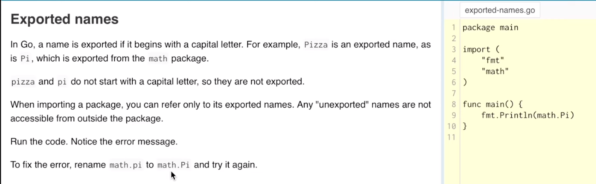
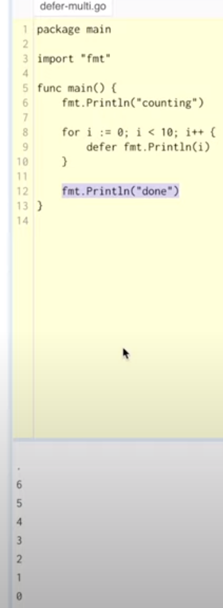

# GO MOD

## Trong ngôn ngữ lập trình Go, file go.mod là một phần quan trọng của hệ thống quản lí module. Đây là một tiếp cận mới để quản lí các dependencies trong dự án Go

1. Quản lý Phiên Bản Phụ Thuộc: go mod cho phép các nhà phát triển xác định và quản lý phiên bản của các thư viện mà họ sử dụng. Điều này giúp đảm bảo rằng mọi người trong dự án đều sử dụng cùng một phiên bản của các thư viện, giúp tránh các vấn đề tương thích. ~~ package.json </br>

2. Tự Động Tải Phụ Thuộc: Khi sử dụng go mod, Go có thể tự động tải xuống các phụ thuộc cần thiết cho dự án, dựa trên thông tin được xác định trong tệp go.mod. </br>

3. Tạo Môi Trường Độc Lập: go mod hỗ trợ việc tạo môi trường phát triển độc lập cho mỗi dự án, giúp tránh xung đột giữa các dự án khác nhau trên cùng một máy. </br>

4. Tính Minh Bạch và Dễ Dàng Quản Lý: Tệp go.mod chứa danh sách rõ ràng các phụ thuộc cùng với phiên bản của chúng, làm cho việc quản lý và hiểu rõ về các phụ thuộc trở nên dễ dàng hơn. </br>

5. Tương Thích Với Các Hệ Thống Đóng Gói Khác: go mod cung cấp khả năng tương thích tốt với các hệ thống quản lý gói của ngôn ngữ lập trình khác, giúp dễ dàng tích hợp trong các hệ thống phức tạp. </br>

6. Đơn Giản Hóa Quy Trình Xây Dựng và Phát Triển: Việc sử dụng go mod giúp đơn giản hóa quy trình xây dựng và phát triển, vì các nhà phát triển không cần phải lo lắng về việc cài đặt và cấu hình thủ công các thư viện. </br>

## PACKAGE

1. Bất kì chương trình nào cũng đều xây dựng từ những packages. </br>
2. Tên các package sẽ bất buộc phải viết thường, không được viết hoa.

## IMPORT

1. Ngôn ngữ Go không được dùng giấu ;

## EXPORTED NAMES

1. Giống như là một biến từ một package khác gọi vào. Ví dụ hàm Println sẽ xây dựng ở package và ở package main gọi hàm này. </br>
2. Các exported names sẽ phải viết hoa.
   
   </br>

## FUNCTIONS

```
package main

import (
	"fmt"
)

func swap(x , y string) (string, string) {
	return y, x
}

func main() {
	a,b := swap("hello", "world")
	fmt.Println(a,b)
}
```

</br>

### VARIABLES

```
	// Khai báo biến có 2 cách
	var i,j int = 1,2
	// Biến python sẽ tự hiểu type của biến
	python := "short"
	fmt.Println(i,j,python)
```

### BASIC TYPE

```
Kiểu dữ liệu ở Go khá là chi tiết vì Go là ngôn ngữ ~~ ngôn ngữ máy như C, C++
```

### ZERO VALUES

```
0 for numeric types,
false for the boolean typ
"" for strings

fx:
var i int
var f float 64
var b bool
var s tring
```

### TYPE CONVERSIONNS

```
// Ép kiểu
var i int = 42
var f float64 =  float(i)
```

### TYPE INFERENCE

```
var i int,
k := 2 // k is an int
```

### CONSTANTS

```
const PI = 3.14
// constant cannot be declared using the := systax

const {
  BIG = 1 << 100
  SMALL = BIG >> 99
}
```

### FOR CONTINUED

```
//
package main

import "fmt"

func main() {
	sum := 0
  // Không cần phải có giấu () ở for
	for i := 0; i < 10; i++ {
		sum += i
	}
	fmt.Println(sum)

  // Ở ngôn ngữ Go không có từ khóa while
  sum := 1
  for sum < 1000 {
    sum += sum
  }
	fmt.Println(sum)

  // Forever
  for {
    // Như này đã là vòng lặp vô tận
  }
}
```

### IF ELSE

```
func pow(x, n, lim float64) float64 {
	v := math.Pow(x,n)
	if v < lim {
		return v
	} else {
		return 0
	}
}
```

### SWITCH CASE

```
	switch os:= runtime.GOOS; os {
	case "darwin": fmt.Println("macOS")
	case "linux": fmt.Println("Linux")
	default:
		fmt.Printf("%s", os)
	}
  t:= time.Now()
	switch{
		case t.Hour() < 12: fmt.Println("Good Morning")
		case t.Hour() < 12: fmt.Println("Good Afternoon")
		default: fmt.Println("Good Evening")
	}
```

### DEFER

```
// Từ khóa defer chỉ có ngôn ngữ Go mới có, thì việc thêm defer này nhằm để thực thi một func, một biến trước func exit của chương trình
  defer fmt.Printf(os)
  fmt.Printf("Hello world!")
// Thì console sẽ xuất hiện Hello world trước và fmt.Printf(os) sẽ print ra trước khi chương trình exit
// Tác vụ của nó ví dụ như các bạn mở một file hay stream thì đó ra thì cuối chương trình thì phải close nó lại
// Và nó mang tính chất stacking => Last in fist out
```


</br>

# Lập trình Golang #4: Pointer, Struct, Slice và Map

### POINTER

```
// Là một Pointer tường minh
var p *int
i:= 42
p = &i

// Unlike C, Go has no pointer arithmetic

// Pointer dùng mọi nơi trong Golang

```

### STRUCT

```
// Tên Struct thì phải viết Hoa chữ cái đầu
// Fx: Vertex exported, thì ở ngoài có thể nhìn thấy nó và dùng nó,  vertex unexported, thì ở ngoài không thể thấy và dùng nó

package main

import "fmt"

type Vertex struct {
	X int
	Y int
}

var(
	v1 = Vertex{1, 2} // has type Vertex
	v2 = Vertex{X: 1} // Y:0 is implicit
	v3 = Vertex{} // X:0 and Y:0
	p = &Vertex{1, 2} // has type *Vertex
)

func main() {

	v := Vertex{1, 2}
	v.X = 4

	fmt.Println(v.X)

	// Using piointer
	p:= &v // Dùng con trỏ p trỏ đến ô nhớ địa chỉ của v
	p.X = 10 // Thay đổi giá trị của v thông qua con trỏ p
	fmt.Println(v.X)

	z := &Vertex{1, 2} // has type *Vertex
	fmt.Println(z.X)
}
```

### ARRAYS

```
package main

import "fmt"

func main() {
	var a [2]string // Biến a là mảng string có 2 phần tử
	a[0] = "Hello"
	a[1] = "World"
	fmt.Println(a[0], a[1])
	fmt.Print(a)
}
```

### SLICES

```
// Được hiểu đơn giản là một mảng được cắt ra
// Khai báo slice khác ở khai báo mảng là slices khai báo trước type là một ngoặc vuông rỗng []
// Fx: var s []int = primes[1:4] Lấy từ phần tử thứ 2 đến thứ 5 vì index đếm từ 0
```

### SLICES LENGTH & CAPACITY

```
// Lengh là độ dài thực của mảng đó
// Capacity là độ rộng của mảng đó
// Giả sử như khi không có capacity thì khi thêm 1 phần tử mới thì sẽ phải tạo ra 1 ô nhớ chứa mảng đó có lengh + 1 và sao chép toàn bộ mảng cũ qua mảng mới và thêm phần tử mới vào
// Khi có capacity thì không cần phải lo về vấn đề cấp phát thêm ô nhớ mới

// Có 1 hàm make để tạo slice với 3 tham số []type, len, cap
// Fx1:
 a:= make([]int, 5) // chỉ khai báo có length
 b:= make([]int, 0, 5) // có đầy đủ 3 tham số type, lengh, capacity

```

### SLICES OF SLICES

```
// Slices can contain any type, including other slices
```

### Appending to a slice

```
// Hàm append sẽ return về một slices mới tức là sẽ sinh ra một ô nhớ mới
```
